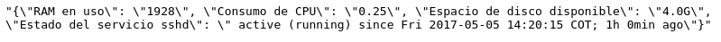
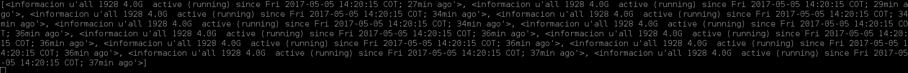
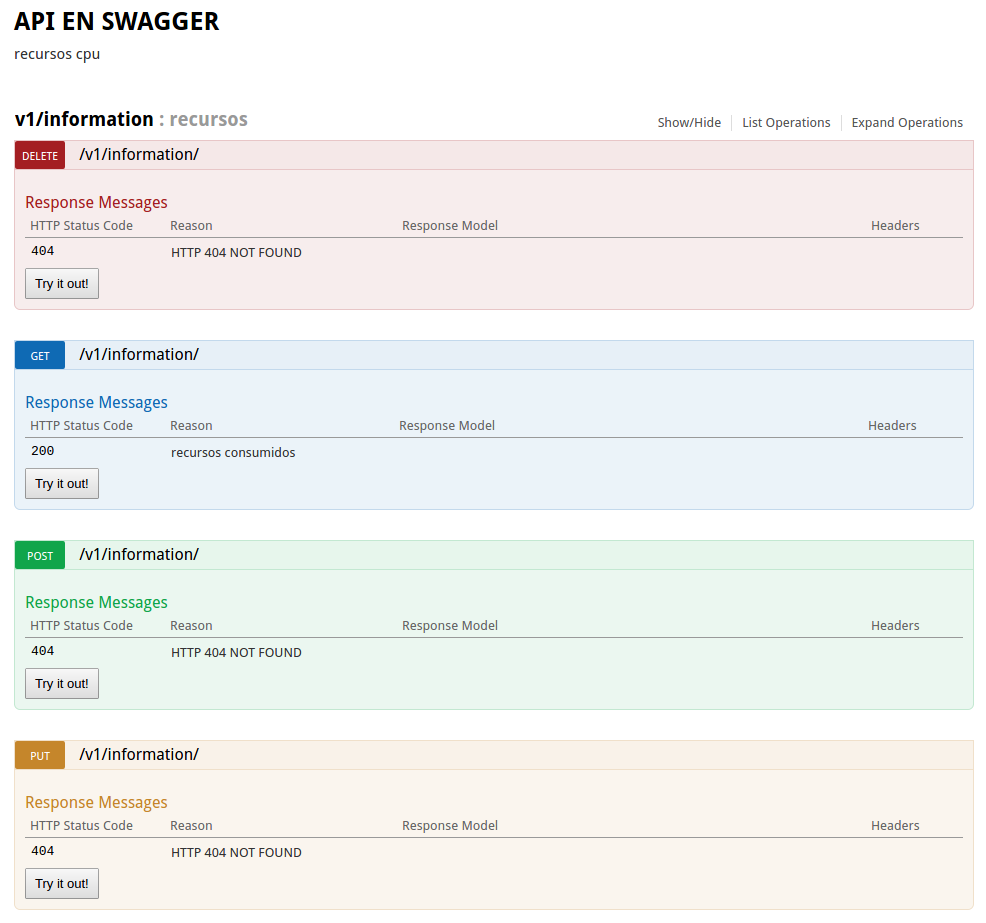
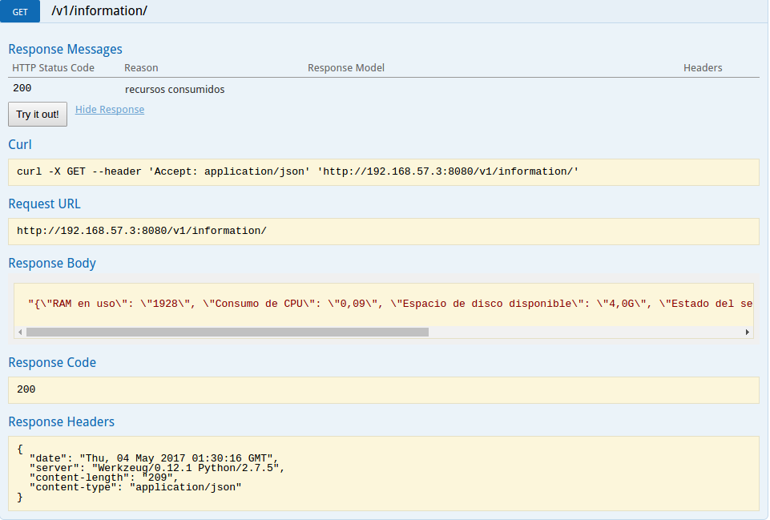

### Parcial 2 sistemas operativos

### Estudiantes: 
**Jorge Hernandez - A00317220**

**URL de github: //github.com/GeorgeArturo/so-exam2 **

### Procedimiento

* Lo primero que se realizo fue el script que me de los datos que requiero de la CPU, para esto se uso el siguiente Script

``` python
from subprocess import Popen, PIPE

def memoria():
  grep_process = Popen(["vmstat", "-s","-S","m"], stdout=PIPE,stderr=PIPE)
  listado_stats= Popen(["awk", '{print $1}' ],stdin=grep_process.stdout, stdout=PIPE, stderr=PIPE).communicate()[0].split('\n')

  print(listado_stats)
  return filter(None, listado_stats)


def get_cpu():
  df_process = Popen(["mpstat"], stdout=PIPE, stderr=PIPE)
  awk_process = Popen(["awk", '{print $3}'], stdin=df_process.stdout, stdout=PIPE, stderr=PIPE).communicate()[0].split('\n')

  return filter(None, awk_process)


def get_espacioDisco():
        df_process = Popen(["df","-h",'/dev/mapper/cl-root'], stdout=PIPE, stderr=PIPE)
        awk_process = Popen(["awk", '{print $4}'], stdin=df_process.stdout, stdout=PIPE, stderr=PIPE).communicate()[0].split('\n')


        return  filter(None, awk_process)

def getEstado():
        df_process = Popen(["/usr/sbin/service","sshd","status"], stdout=PIPE, stderr=PIPE)
        awk_process = Popen(["awk",'-F' ,'Active:', '{print $2}'], stdin=df_process.stdout, stdout=PIPE, stderr=PIPE).communicate()[0].split('\n')

        return filter(None, awk_process)
```
* cabe destacar que para realizar el metodo get_cpu se instalo sysstat, se uso el siguiente comando

```
 yum install sysstat
 ```
 * Despues de tener eso para probar su funcionamiento se uso el siguiente script
  
``` python
from flask import Flask, abort, request
from flask_restplus import Resource, Api
from flask_restplus import  fields
import json

from logica import memoria, get_espacioDisco, get_cpu, getEstado

app = Flask(__name__)
#api_url= '/v1.0'

api = Api(app,version='1', title='API EN SWAGGER', description="recursos cpu")
ns = api.namespace('v1/information',description='recursos')
@ns.route('/')
#@app.route(api_url+'/information', methods=['GET'])
class informacion(Resource):
 @api.response(200,'recursos consumidos')
 def get(self):
  list = {}

  list["RAM en uso"] = memoria()[0]
  list["Espacio de disco disponible"]= get_espacioDisco()[1]	
  list["Consumo de CPU"]= get_cpu()[2]
  list["Estado del servicio sshd"]= getEstado()[0]
  return json.dumps(list),200

 @api.response(404,'HTTP 404 NOT FOUND')
 def post(self):
  return "HTTP 404 NOT FOUND",404


 @api.response(404,'HTTP 404 NOT FOUND')
 def put(self):
  return "HTTP 404 NOT FOUND",404


 @api.response(404,'HTTP 404 NOT FOUND')
 def delete(self):
  return "HTTP 404 NOT FOUND",404


if __name__=="__main__":

  app.run(host='0.0.0.0', port=8080, debug='True')

```
* prueba de funcionamiento




* A continuación procedio a guardarse esta información en una base de datos, para eso primero se creo el modelo de la base de datos con el siguiente script:

``` python
from flask import Flask
from flask_sqlalchemy import SQLAlchemy

app = Flask(__name__)
app.config['SQLALCHEMY_DATABASE_URI'] = 'sqlite:////home/check_user/envs/prueba.db'
db = SQLAlchemy(app)


class Datos(db.Model):
    id = db.Column(db.Integer, primary_key=True)
    consumoCpu = db.Column(db.String(80), nullable=False)
    consumoRam = db.Column(db.String(120), nullable=False)
    espacioDisco = db.Column(db.String(120), nullable=False)
    service = db.Column(db.String(120), nullable=False)


    def __init__(self,consumoCpu,consumoRam, espacioDisco, service):
        self.consumoCpu = consumoCpu
        self.consumoRam = consumoRam
        self.espacioDisco = espacioDisco
        self.service = service

    def __repr__(self):
	informacion = self.consumoCpu +" " + self.consumoRam + " " + self.espacioDisco+ " " + self.service

        return '<informacion %r>' % informacion
```

* una vez teniendo el modelo lo siguiente que se hizo fue crear el script que guardara la información en este modelo:

``` python
from modelo import db
from modelo import Datos
from logica import memoria, get_espacioDisco, get_cpu, getEstado

db.create_all()

datos = Datos(get_cpu()[2],memoria()[0],get_espacioDisco()[1],getEstado()[0] )

db.session.add(datos)
db.session.commit()

var=Datos.query.all()
print(var)
```
* se muestra una prueba de funcionamiento :



* Un requerimiento del problema nos pedia que la base de datos se refrescara cada 60 segundos para se uso el crontab de la siguiente manera

``` python
crontab -u check_user -e
```
* despues de ejecutar este comando nos llevara a un archivo donde debemos poner lo siguiente


* Ya con esto nos aseguramos que el script se ejecute cada 60 segundos

* A continuación se muestra la documentación de la aplicación hecha en swagger



